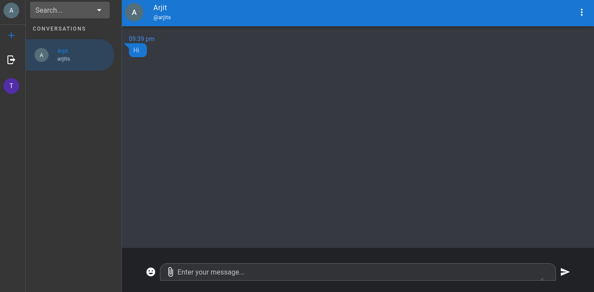

# Chat

A simple elixir based chat with a vue based frontend supporting direct and group chats.

## Table of contents
* [About the project](#about-the-project)
  * [Built with](#built-with)
* [Features](#features)
* [Getting Started](#getting-started)
* [Development](#development)
* [Todo](#todo)
* [Contributing](#contributing)
* [License](#license)

## About the project




I decided to build a chat app while learning elixir. The app uses [phoenix pub/sub](https://github.com/phoenixframework/phoenix_pubsub) with the default pg2 adapter for establishing connectionss, the actual conversation happens directly.

## Built with
* Elixir
  * [Phoenix Pub/Sub](https://github.com/phoenixframework/phoenix_pubsub)
  * [Syn](https://github.com/ostinelli/syn)
  * [Manifold](https://github.com/discord/manifold)
  * [libcluster](https://github.com/bitwalker/libcluster)
  * [Ecto](https://github.com/elixir-ecto/ecto)
* Vue
* Mysql

Webrtc is used to establish p2p connections. This is currently used to only send image files but could be expanded for direct audio/video chats without major changes.

## Features
- Direct chat
- Group chat
- Image send/receiving for direct chats
- Emoji support
- Material design
- Cluster formation/healing through libcluster. (*Note*: Might need minor changes to use different cluster strategies)
- Minimum external dependencies. Only elixir and a database is required
- Distillery support

## Getting started

- Before starting make sure you have elixir and mysql installed.
- Clone the repo
```bash
git clone github.com/arjit95/elixir-chat
cd elixir-chat
```

- Update DB connection parameters by editing `config/config.exs` & `config/dev.exs`, or add the following environment variables to your terminal session

```bash
 # DB connection parameters
 DB_NAME=
 DB_USERNAME=
 DB_PASSWORD=
 DB_HOSTNAME=
 DB_PORT=

 # Server port
 PORT=
 # JWT Token secret
 SIGNING_KEY=
```

- Below command should setup your app and create necessary sql tables
```bash
mix setup
```

- Run your app
```bash
mix run --no-halt
# or
iex -S mix run
```
- The app should be running on port 4000 by default.

### Development

Once the backend server is started any changes to frontend will also need to be updated. Currently Nuxt.js does not allow to serving static files without running a server. So a custom script is used to generate them on any change. If you are not interested in frontend changes you can skip this part.

- Install nodejs on your system if not already available.
- Install node dependencies for the project
```bash
cd web
npm i
```
- Run the watcher session by running dev.js. This would automatically generate static files on each change. Entire project build might not be needed each time but it is still slower than the dev server provided with nuxt.

```bash
node dev.js
```

### Todo
- Since only 1 page is handling most of the user interaction, if possible break it into smaller parts to make it more manageable.
- Add support for various real-time features like x is typing, x is online, last seen. Most of them should be easy to integrate with the current architecture.
- Add message batching to reduce number of rpc calls.
- Better UI for image attachments, increase type of attachments.
- Better error handling.

### Contributing
The basic set of generated frontend resources are already present in priv/static. So there is no need to add those folders again if you change any frontend logic and decide to submit your pull request.

1. Fork the Project
2. Create your Feature Branch (git checkout -b feature/AmazingFeature)
3. Run formatter using `mix format` on elixir codebase & prettier/eslint for frontend changes
4. Commit your Changes (git commit -m 'Add some AmazingFeature')
5. Push to the Branch (git push origin feature/AmazingFeature)
6. Open a Pull Request

## License
The code is licensed under MIT licenese. See `LICENSE` for more information.
